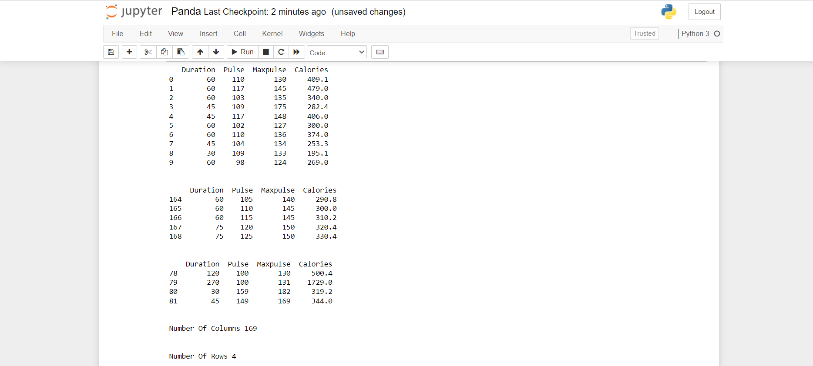

# READ-FROM-CSV

## AIM:
To execute a python program to read and extract data from a csv file.

## ALGORITHM:
### Step 1:
Import module pandas.
### Step 2:
Read the csv file using read_csv()
### Step 3:
Use head() and tail() to read the rows from beginning and rows from end respectively.
### Step 4:
Use loc() to look for specified rows
### Step 5:
Use axes[0] and axes[1] to find the number of columns and number of rows respectively.
### Step 6:
Execute the program.

## PROGRAM:
```
import pandas as pd
df=pd.read_csv('data.csv')
print(df.head(10))
print("\n")
print(df.tail(5))
print("\n")
print(df.loc[[78,79,80,81],:])
print("\n")
print("Number Of Columns",len(df.axes[0]))
print("\n")
print("Number Of Rows",len(df.axes[1]))
```

## OUTPUT:


## RESULT:
Hence a python program is developed and executed to read and extract data from a csv file.
